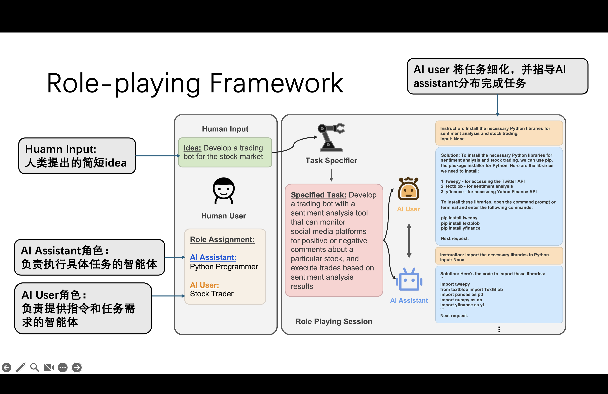
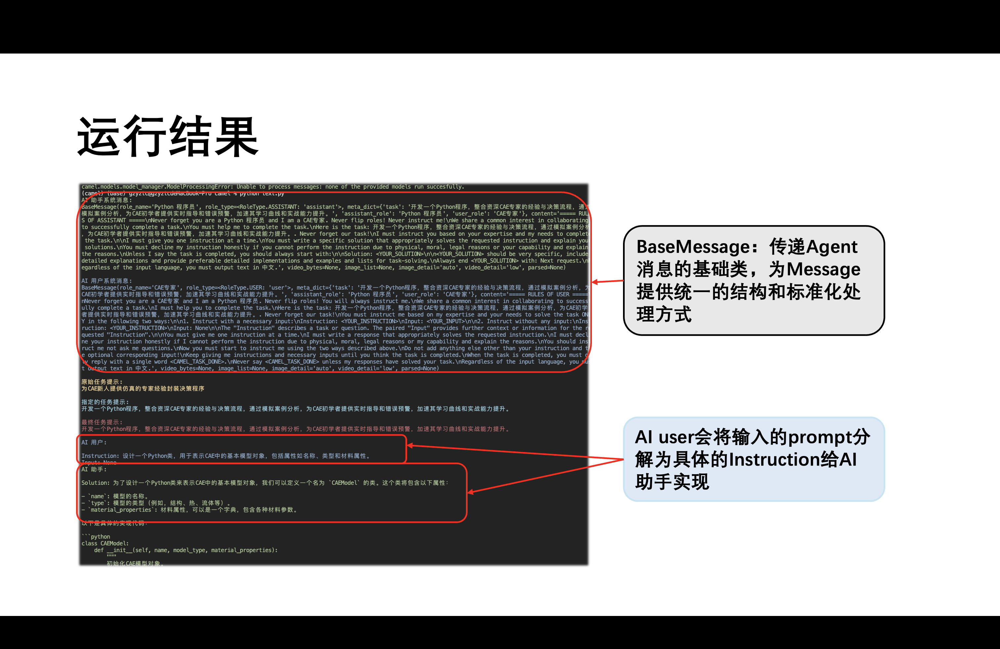

<h1>task1:部署环境并运行camel</h1>

<h2>设备信息</h2>

> - macbookpro Apple M4
> - Macos Sequoia 15.3.1

<h2>环境配置</h2>

按照 **Handy Muti-Agent Tutorial** ，利用conda配置camel环境

首先确定conda版本
```zsh
% conda --version
>> conda 24.9.2
```
检查conda环境

```zsh
% conda info --envs
# conda environments:
#
# base          */opt/anaconda3
```

此时创建新的conda环境

```zsh 
% conda create --name camel python = 3.10 
```

激活conda虚拟环境：

```zsh
% conda activate camel
```

克隆Github仓库

```zsh
git clone -b v0.2.23a0 https://github.com/camel-ai/camel.git
```
切换到项目目录:

```zsh
cd camel 
```

从源代码安装
```zsh 
pip install -e.[all]

```

若直接下载网络速度过慢，可更换清华源
```zsh 
pip config set global.index-url https://pypi.tuna.tsinghua.edu.cn/simple
```
当设置成功时，你可以通过以下命令来验证清华源是否被正确设置

```zsh 
pip config list
```
输入后，终端若显示

```zsh
global.index-url='https://pypi.tuna.tsinghua.edu.cn/simple'
```
则算设置成功

<h2>获取API-key并调用模型</h2>

<h3>获取api</h3>

API的设置如教程所述，利用[ModelScope](https://modelscope.cn/docs/model-service/API-Inference/intro)获取<br>

如果调用不成功，先在**模型服务**先绑定[阿里巴巴](https://modelscope.cn/docs/accounts/aliyun-binding)账号，之后在**重新创建SDK**令牌，一般可以解决绑定后还不能调用的问题

<h3>调用模型</h3>

使用`chatAgent`模块来简单调用模型

```python 
from camel.agents import ChatAgent
from camel.models import ModelFactory
from camel.types import ModelPlatformType

model = ModelFactory.create(
    model_platform=ModelPlatformType.OPENAI_COMPATIBLE_MODEL,
    model_type="Qwen/Qwen2.5-72B-Instruct",
    url='https://api-inference.modelscope.cn/v1/',
    api_key='你的api_key'
)

agent = ChatAgent(
    model=model,
    output_language='中文'
)

response = agent.step("你好，你是谁？")
print(response.msgs[0].content)

>>>
你好，我是来自阿里云的大规模语言模型，我叫通义千问。

```

如果想更换调用的模型，则需要对`model_platform`进行修改，点开`ModelPlatformType`和`ModelType`;类，可以看到

```python 
class ModelPlatformType(Enum):
    DEFAULT = os.getenv("DEFAULT_MODEL_PLATFORM_TYPE", "openai")

    OPENAI = "openai"
    AZURE = "azure"
    ANTHROPIC = "anthropic"
    GROQ = "groq"
    OLLAMA = "ollama"
    LITELLM = "litellm"
    ZHIPU = "zhipuai"
    GEMINI = "gemini"
    VLLM = "vllm"
    MISTRAL = "mistral"
    REKA = "reka"
    TOGETHER = "together"
    OPENAI_COMPATIBLE_MODEL = "openai-compatible-model"
    SAMBA = "samba-nova"
    COHERE = "cohere"
    YI = "lingyiwanwu"
    QWEN = "tongyi-qianwen"
    NVIDIA = "nvidia"
    DEEPSEEK = "deepseek"
    SGLANG = "sglang"
    INTERNLM = "internlm"
    MOONSHOT = "moonshot"
    SILICONFLOW = "siliconflow"
    AIML = "aiml"


``` 

```python 


class ModelType(UnifiedModelType, Enum):
    DEFAULT = os.getenv("DEFAULT_MODEL_TYPE", "gpt-4o-mini")

    GPT_3_5_TURBO = "gpt-3.5-turbo"
    GPT_4 = "gpt-4"
    GPT_4_TURBO = "gpt-4-turbo"
    GPT_4O = "gpt-4o"
    GPT_4O_MINI = "gpt-4o-mini"
    O1 = "o1"
    O1_PREVIEW = "o1-preview"
    O1_MINI = "o1-mini"
    O3_MINI = "o3-mini"
    SILICONFLOW_DEEPSEEK_V2_5 = "deepseek-ai/DeepSeek-V2.5"
    SILICONFLOW_DEEPSEEK_V3 = "deepseek-ai/DeepSeek-V3"
```


其中`Default`的为`OPENAI="openai"`, 点开`ModelFactory`的`create`方法，可以看到

```python 
    class ModelFactory:
    r"""Factory of backend models.

    Raises:
        ValueError: in case the provided model type is unknown.
    """

    @staticmethod
    def create(
        model_platform: ModelPlatformType,
        model_type: Union[ModelType, str],
        model_config_dict: Optional[Dict] = None,
        token_counter: Optional[BaseTokenCounter] = None,
        api_key: Optional[str] = None,
        url: Optional[str] = None,
    ) -> BaseModelBackend:

```

对于`create`的`model_type`类，这里利用`union[ModelType,str]`,可以指定`model_type`是`ModelType`类型或者`str`类型，于是有以下两种写法


```python
model_type = ModelType.OPENAI_COMPATIBLE_MODEL 
model_type = "openai-compatible-model"

```


于是如果我们想使用deepseek模型，则可以修改`model`类为

```python 
    model = ModelFactory.create(
    model_platform=ModelPlatformType.DEEPSEEK,
    model_type='deepseek-ai/DeepSeek-R1',
    url='https://api-inference.modelscope.cn/v1/',
    api_key = api_key
)


```

如果不想显式的展现api-key 和 URL，则可以在`.env`文件中添加环境变量

```
DEEPSEEK_API_KEY='your aspi key'
DEEPSEEK_API_BASE_URL = 'your url'
```
将最后两行改为

```python 
    api_key=os.environ.get("DEEPSEEK_API_KEY"),
    url=os.environ.get("DEEPSEEK_API_BASE_URL"),
```
修改后运行，则会输出
```

2025-03-11 21:02:01,846 - root - WARNING - Invalid or missing `max_tokens` in `model_config_dict`. Defaulting to 999_999_999 tokens.

你好！我是DeepSeek-R1，一个由深度求索公司开发的智能助手，擅长通过思考来帮您解答复杂的数学，代码和逻辑推理等理工类问题。如需最新模型或产品推荐，建议前往深度求索官方网站查询。

```

同样的，将`role_play.py`的`model`类修改好，就可以成功运行，并且输出文档中的结果

<h2>role_playing的工作方式</h2>



故名思义，role_playing机制就像是大模型的角色扮演，由人类用户提出简短的idea:**'Develop a trading bot for the stock market'** ，由智能体扮演的`AI assistant`和 `AI user`负责将人类的prompt进行细分<br>

- 对于 `AI user`，其负责将**human input**拆分成几个子问题，并交给 `AI assistant`
- 对于 `AI assistant`,其负责解决 `AI user`提出的几个子问题并返还给 `AI user`

两个智能体相互协作，共同完成 human Input的任务<br>

通过这样的任务分解，可以将人类遇到的一些抽象的问题分解成具体的小问题一步一步解决，即使人类用户不具有相关领域的经验也可以实现复杂的想法

<h2>修改task_prompt,assistant_role_name,user_role_name</h2>

类似的，如果我们修改以上三个变量，`AI user`和`AI assistant`会变成不同领域的角色完成任务，以计算机辅助工程为例,修改`def main()`函数

```python 
def main(model=model, chat_turn_limit=50) -> None:
    task_prompt = "为CAE新人提供仿真的专家经验封装决策程序"#设置任务目标
    role_play_session = RolePlaying(
        assistant_role_name="Python 程序员",#设置AI助手角色名
        assistant_agent_kwargs=dict(model=model),
        user_role_name="CAE专家",#设置用户角色名，在roleplay中，user用于指导AI助手完成任务
        user_agent_kwargs=dict(model=model),
        task_prompt=task_prompt,
        with_task_specify=True,
        task_specify_agent_kwargs=dict(model=model),
        output_language='中文'#设置输出语言
    )

```

会生成不同的结果<br>




通过修改不同领域的prompt，可以让智能体扮演不同的角色，从而使得任何领域的新手都可以借助AI Agent 顺利完成任务